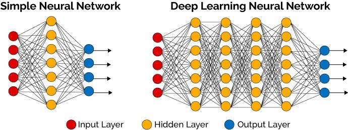

# Neural Network: Charity Analysis
## Background
Bek’s come a long way since her first day at that boot camp five years ago—and since earlier this week, when she started learning about neural networks! Now, she is finally ready to put her skills to work to help the foundation predict where to make investments.

With your knowledge of machine learning and neural networks, you’ll use the features in the provided dataset to help Beks create a binary classifier that is capable of predicting whether applicants will be successful if funded by Alphabet Soup.

Beks received a CSV directly from Alphabet Soup’s business team containing more than 34,000 organizations that have received funding from Alphabet Soup over the years. This dataset contains the following:

* **EIN and NAME**—Identification columns: ***no need to keep for model***
* **APPLICATION_TYPE**—Alphabet Soup application type ***INPUT FEATURE***
* **AFFILIATION—**Affiliated sector of industry  ***INPUT FEATURE***
* **CLASSIFICATION**—Government organization classification ***INPUT FEATURE***
* **USE_CASE**—Use case for funding ***INPUT FEATURE***
* **ORGANIZATION**—Organization type ***INPUT FEATURE***
* **STATUS**—Active status ***INPUT FEATURE***
* **INCOME_AMT**—Income classification ***INPUT FEATURE***
* **SPECIAL_CONSIDERATIONS**—Special consideration for application ***INPUT FEATURE***
* **ASK_AMT**—Funding amount requested ***INPUT FEATURE***
* **IS_SUCCESSFUL**—Was the money used effectively: ***TARGET VARIABLE***

## Overview of the analysis: 
Using One Hot Encoder,the following categorical fields were transformed to a numeric value:

## Results: 

#### Data Preprocessing

***What variable(s) are considered the target(s) for this model?***
For this model, the target is held in the IS_SUCCESSFUL field.

***What variable(s) are considered to be the features for this model?***

* APPLICATION_TYPE
* AFFILIATION
* CLASSIFICATION
* USE_CASE
* ORGANIZATION
* STATUS
* INCOME_AMT
* SPECIAL_CONSIDERATIONS
* ASK_AMT

***What variable(s) are neither targets nor features, and should be removed from the input data?***

* EIN
* NAME

#### Compiling, Training, and Evaluating the Model

**Model Configuration:**

* number_input_features = 43
* hidden_nodes_layer1 = 80
* hidden_nodes_layer2 = 30

***Were you able to achieve the target model performance?***. 
No; this model only acheived 63.8% accuracy

***What steps did you take to try and increase model performance?***
Several attempts to incraese the accuracy of the model were taken, including:

1. Increasing the number of hidden nodes in layer 1 (3 X number of input features)
2. Increasing the number of hidden layers to include a 3rd
3. Changing the activation functions: tried linear, tanh, sigmoid for a combination of hidden layers and output layer

None of these attempts yielded a better accuracy score. 

 
## Summary
Summarize the overall results of the deep learning model. Include a recommendation for how a different model could solve this classification problem, and explain your recommendation.